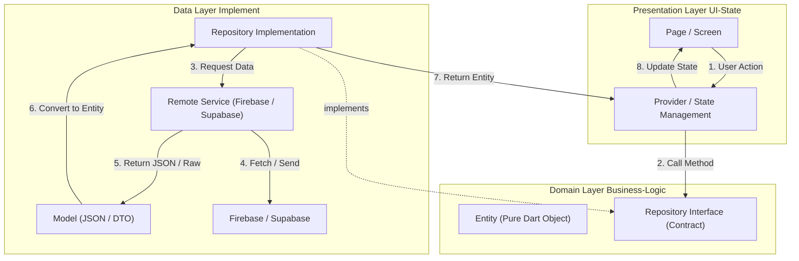
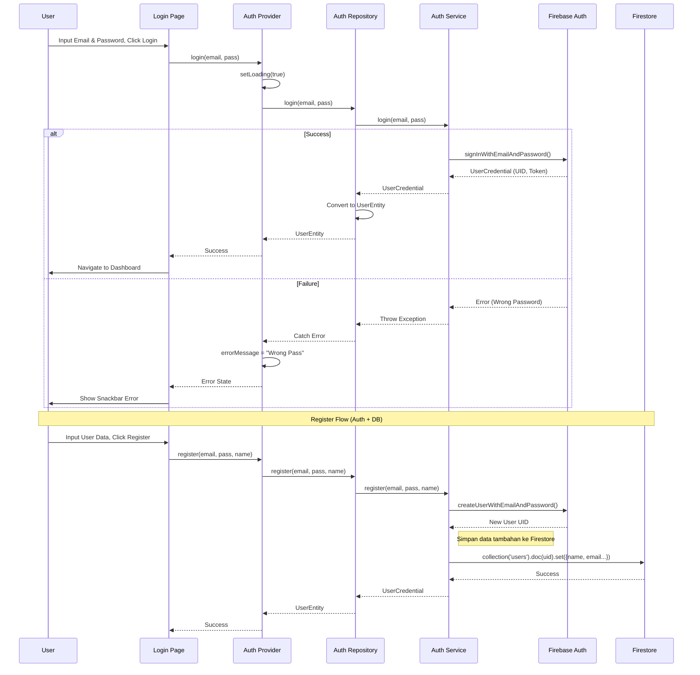
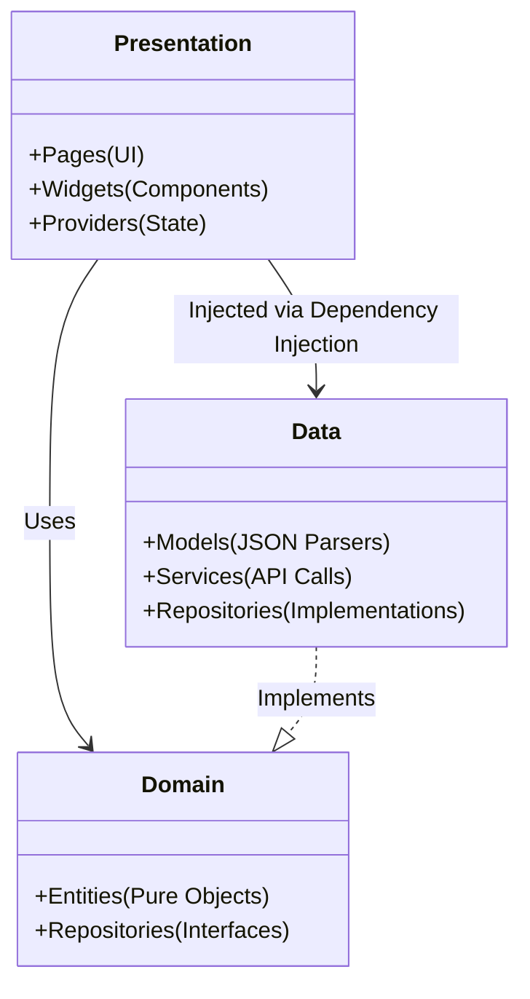

# Arsitektur & Integrasi Flow

Berikut adalah visualisasi alur data dan komunikasi antar layer dalam aplikasi Suara Kampus menggunakan Clean Architecture dan integrasinya dengan Firebase/Supabase.

## 1. Clean Architecture Layer Flow
Diagram ini menunjukkan bagaimana UI berkomunikasi dengan Logic tanpa tahu detail teknis (Database).

## 2. Detail Integrasi Firebase Code Flow
Contoh spesifik untuk fitur **Login & Register**.

## 3. Struktur Folder vs Architecture

